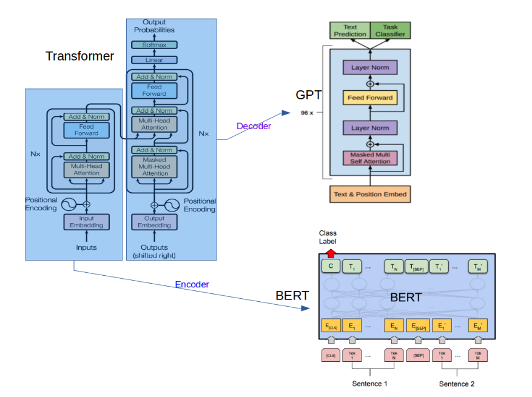

# GPT-3 Exploration and Examples


This project includes several examples showcasing the capabilities of the GPT-3 model: it generates humorous ideas for annoying someone, creates Python code for tasks like list addition, integer addition, and finding the maximum in a list, performs simple logical reasoning and basic calculations, answers questions with factual responses while labeling nonsensical queries as "Unknown", simulates conversation with an AI assistant, translates English to French, simplifies complex scientific concepts for a child audience, checks the model's knowledge base with factual response tests, classifies names into categories such as Fund, Company, or Bond, and demonstrates how well the model can match documents to relevant search queries.

GPT-3 is based on the transformer architecture, specifically using the decoder part, making it autoregressive. Its strength lies in its large scale, leading to impressive results in zero or few-shot learning scenarios.


## Setup

```python
# !pip install openai
# !export OPENAI_API_KEY="_"
# !echo 'export OPENAI_API_KEY="_"' >> ~/.bashrc
```


